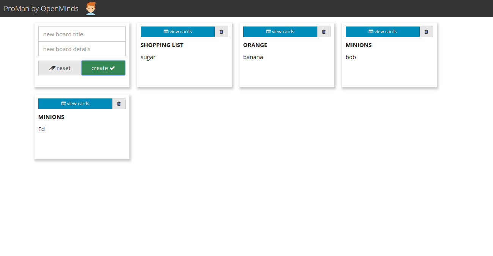

# ProMan 1.0 by OpenMinds

## Using ProMan:

- to start using ProMan simply run `build.py`
- then run  `server.py`
- click on the `url` shown in your terminal
- now you can create boards and cards on them
- both of the boards and cards you can give title and details (limited to 100 characters) which are saved to `central db`
- if you don't need a board anymore, you can delete it :)

## We used the following technologies:
- HTML5
- CSS/Bootstrap [Bootswatch theme](https://bootswatch.com/yeti/)
- JavaScript
- jQuery
- Python 3

### python-with-web-proman
This is the second exercise in the Python with Web module, see instructions in Canvas
